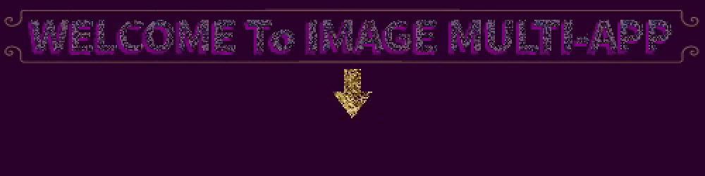
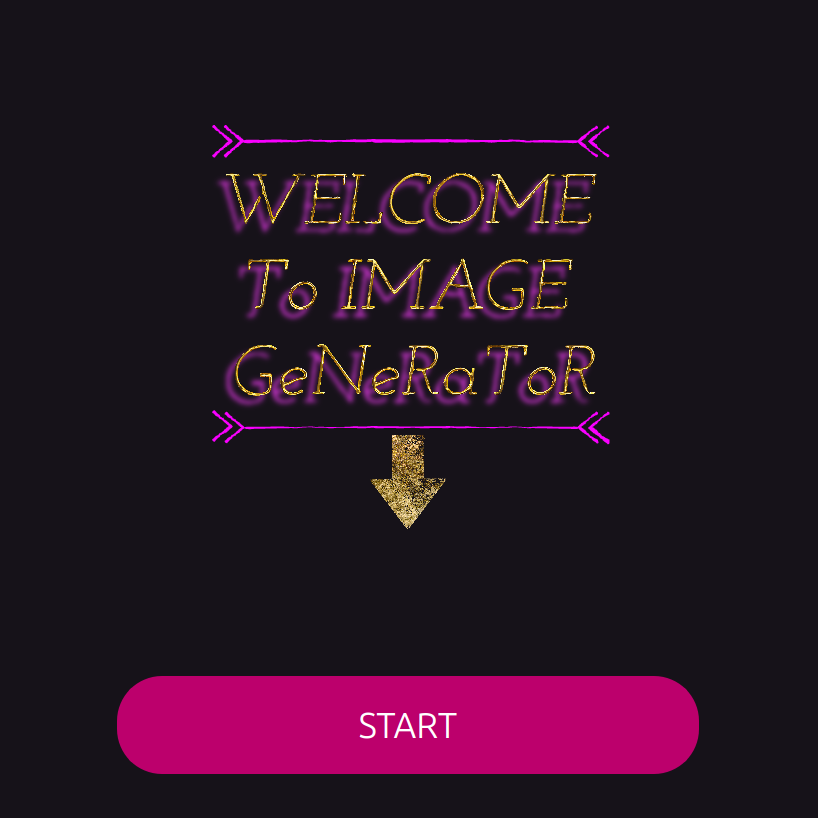
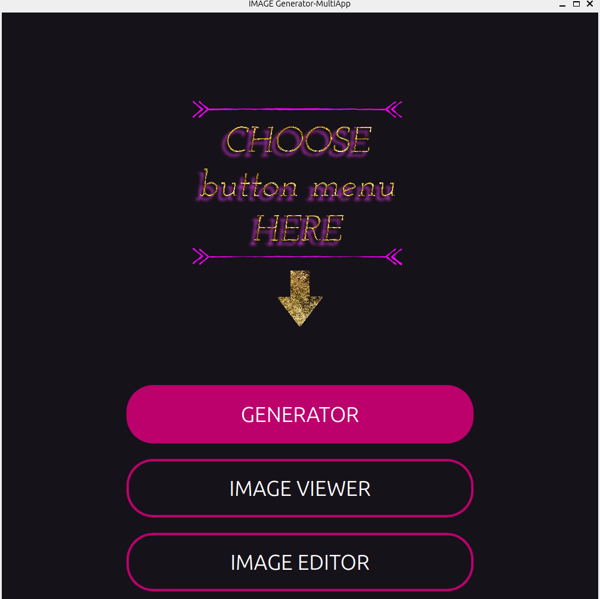
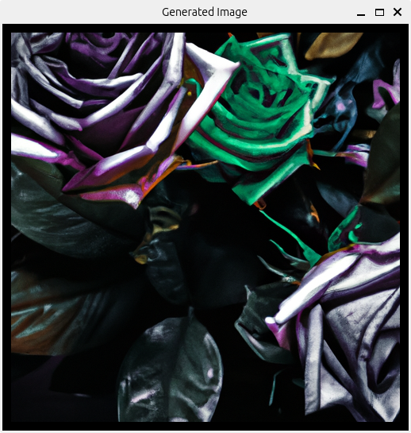
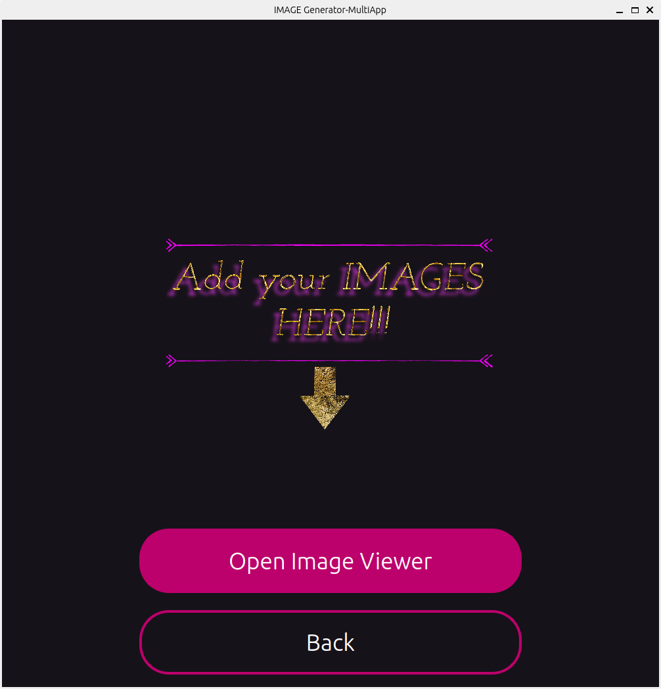
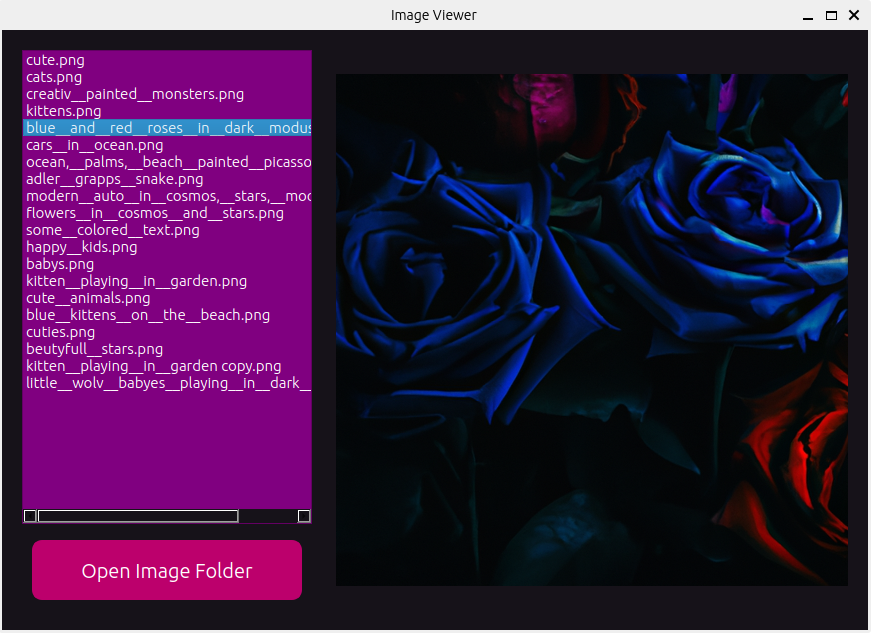
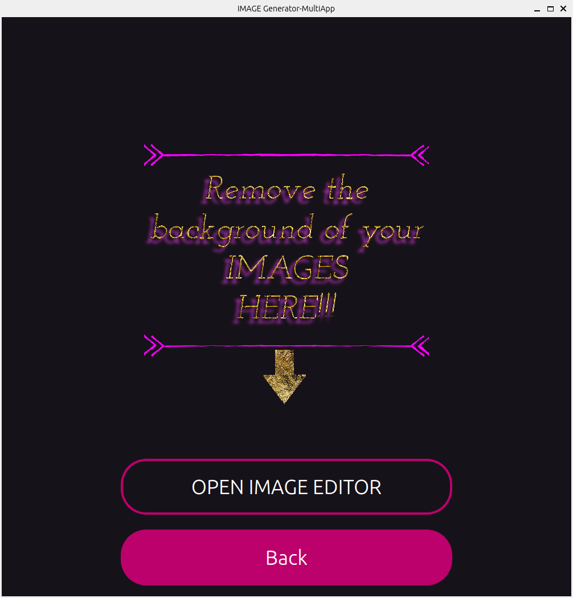
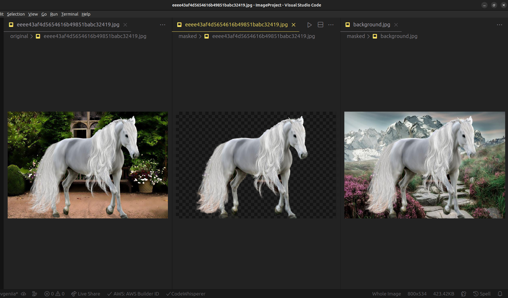

# Project Overview

This project is a PyQt5-based multi-application that includes features for image generation, image viewing, and background removal from images. Below is an overview of the main components and functionality of each Python script used in the project.

## `main.py`

`main.py` serves as the central script for the application. It includes the following key features:

- **Importing Libraries**: The script imports various libraries, including PyQt5 for the graphical user interface, `os` for file operations, and `openai` for image generation using the OpenAI API.

- **Application Initialization**: Initializes a PyQt5 `QApplication` object for managing the graphical user interface.

- **Frame Management**: Defines functions for creating and switching between different frames (pages) of the application.

- **Image Generation**: Implements functions for generating images using the OpenAI API and saving the generated images.

- **Image Viewing**: Provides an image viewer dialog for displaying images.

- **Image Editing**: Offers an image editor dialog for background removal.

- **Main Window**: Creates the main application window (`QMainWindow`) and sets up the initial frame.

- **Button Connections**: Connects various buttons in frames to their corresponding actions.

- **API Key Loading**: Loads the OpenAI API key from a `.env` file.

## `img_viewer.py`

`img_viewer.py` defines a Python module used for creating an image viewer dialog within the application. The main features include:

- **Importing Libraries**: Imports necessary PyQt5 modules for creating the dialog and displaying images.

- **ImageViewerDialog Class**: Defines a custom class `ImageViewerDialog` that represents the image viewer dialog. Key functionalities include initializing the dialog, setting properties, and displaying images.

- **Module Execution**: Provides an example of how to create and execute the `ImageViewerDialog` as a dialog window for viewing images.

## `editor.py`

`editor.py` is another Python module used in the application, specifically for the background removal tool. Key features of this module include:

- **Importing Libraries**: Imports libraries for GUI development, image manipulation, and HTTP requests.

- **BackgroundRemovalDialog Class**: Defines the `BackgroundRemovalDialog` class for the background removal tool. Features include setting up the dialog, creating input widgets for image URLs, and handling background removal logic.

- **Image Input and Processing**: Allows users to input image URLs for the main subject and background images. The tool downloads, masks, and overlays the subject image onto the background image.

- **Image Display**: Displays the resulting masked image in the dialog.

- **Main Block**: If executed as a script, initializes the application and displays the background removal tool dialog.

# Usage

To use the application, follow these steps:

1. Ensure you have installed the required libraries and dependencies mentioned in the project's environment setup.

2. Execute `main.py` to run the multi-application.

3. Use the provided buttons and features to generate images, view images, or perform background removal.

4. Follow the prompts and guidelines provided within the application for each feature.

# Dependencies

- PyQt5
- Python Imaging Library (PIL)
- rembg
- requests

# Project Screenshots

Here are some screenshots of the project:

- **Structure:**
  

- **Welcome:**
  

- **Menu:**
  

- **Description Input:**
  

- **Generated Image:**
  

- **Open Viewer:**
  

- **Image Viewer:**
  

- **Open Editor:**
  

- **Masked Image:**
  

- **Editor Steps:**
  

# Dependencies

- PyQt5
- Python Imaging Library (PIL)
- rembg
- requests

# License

This project is licensed under the [MIT License](LICENSE).
